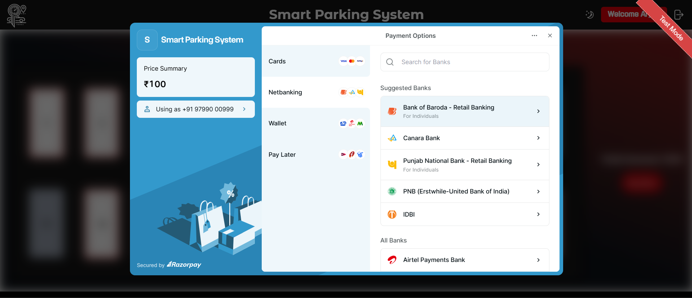
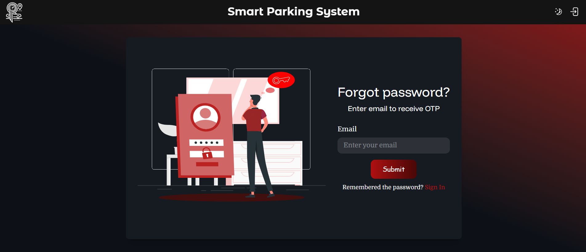
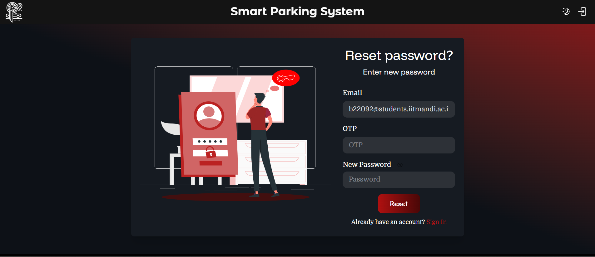

# Smart-Parking-System
## 1. Introduction
- **Project Name:** Smart Parking System  
- **Developed By:** Group No. 2    
- **Team Members:**    
    - Harmandeep Singh  B22208  
    - Sanchitdeep Singh B22128  
    - Kushal Singh Bijarniya  B22113  
    - Gagandeep Singh  B22104  
    - Aryan Jain  B22092  
    - Eshaan  B22039  
    - Siddharth Shainesh  B22135  
    - E. Vrinchi  B22011  

### Description
_The Smart Parking System Website is an intuitive online platform that allows users to easily search, reserve, and pay for parking slots in advance. Designed for convenience and efficiency, the website ensures hassle-free parking by providing real-time availability updates, secure digital payments, and automated entry systems._  

---

## 2. Tech Stack
- **Frontend:** ReactJS, Javascript, Typescript, Tailwind CSS
- **Backend:** Flask[Python]
- **Database:** MongoDB

## 3. User Guide
### 3.1 How to Create Account
1. Click on the "Sign up" button.

2. Enter your email and click on "Enter".

3. You will receive an OTP on your email. Enter the required details along with the OTP and click on "Enter".

Your account has been created and now you are ready to login and book parking slots as per requirement.
  

### 3.2 How to Book a Parking Slot
1. Login to your account using the registered email and password.
2. Select the required venue.

3. Select date and time slot and click on "Submit". Each time slot blocks exactly 1 hour. If you want to book for more than 1 hour select as many time slots as you require. For example, if you select 2:00 AM slot, then slot will be booked from 2:00 AM to 2:59 AM only.

4. Select desired Parking Slot(s) which is(are) available and click on "Pay Now". The total is calculated as per the previous(step 3) and present(step 4) selections.

5. Proceed to pay with your comfortable mode of payment.

6. After a successful transaction, you will receive a message confirming your booking.

You will also receive confirmation mail with the booking details and 2 OTPs which will be required at the venue for entering and exiting the parking area.
In case you stay in the parking slot beyond your booked time slot, you have to pay extra which will be collected while exiting the parking area.
This extra payment can be calculated based on the time we enter the 2nd OTP while exiting.

### 3.3 How to Reset Password
1. Click on "forgot password" in the login page.

2. Enter your registered email.

3. You will receive an OTP on your email. Enter OTP and the new password and click on "Enter".

Now you are ready to login again using the new reset password.

---
